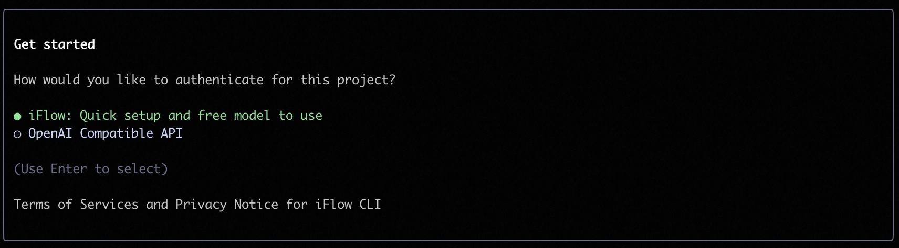

# 🤖 iFlow CLI


[English](README.md) | **中文** | [日本語](README_JA.md) | [한국어](README_KO.md) | [Français](README_FR.md) | [Deutsch](README_DE.md) | [Español](README_ES.md) | [Русский](README_RU.md)

iFlow CLI 是一款直接在终端中运行的强大 AI 助手。它能够无缝分析代码仓库、执行编程任务、理解上下文需求，通过自动化处理从简单的文件操作到复杂的工作流程，全面提升您的工作效率。

## ✨ 核心特性

1. **免费 AI 模型**：通过 [心流开放平台](https://docs.iflow.cn/docs) 访问强大的免费 AI 模型，包括 Kimi K2、Qwen3 Coder、DeepSeek v3 等
2. **灵活集成**：完全支持 OpenAI 协议的模型提供商
3. **直观界面**：简洁的终端体验，提供上下文感知的智能辅助
4. **开箱即用**：预配置的 MCP 服务器和专业代理协同工作，自动解决复杂问题

## 📥 安装

```shell
bash -c "$(curl -fsSL https://cloud.iflow.cn/iflow-cli/install.sh)"
```

此命令会自动为您的终端安装所有必要的依赖项。

**Windows 用户**：请先在终端中启动 `bash`，然后运行上述安装脚本。

## 🔑 身份验证

iFlow Cli提供两种身份验证方式：

1. **推荐方式**：使用 iFlow 原生身份验证
2. **备选方式**：通过 OpenAI 兼容 API 连接



获取 API Key的步骤：
1. 注册 iFlow 账户
2. 进入个人设置页面或点击[此直达链接](https://iflow.cn/?open=setting)
3. 在弹出对话框中点击"重置"生成新的 API 密钥


生成密钥后，将其粘贴到终端提示符中即可完成设置。

## 🚀 快速开始

要启动 iFlow CLI，请在终端中导航到您的工作空间并输入：

```shell
iflow
```

### 创建新项目

对于新项目，只需描述您想要创建的内容：

```shell
cd new-project/
iflow
> 使用 HTML 创建一个基于网页的我的世界游戏
```

### 处理现有项目

对于现有代码库，建议先使用 `/init` 命令帮助 iFlow 理解您的项目：

```shell
cd project1/
iflow
> /init
> 根据 requirement.md 文件中的 PRD 文档分析需求，输出技术文档，然后实现解决方案。
```

`/init` 命令会扫描您的代码库，学习其结构，并创建包含完整文档的 IFLOW.md 文件。

有关斜杠命令的完整列表和使用说明，请查看[这里](./i18/cn/commands.md)。

## 💡 常见使用场景

iFlow CLI 的功能远不止编程，它能处理各种类型的任务：

### 📊 信息查询与规划

```text
> 帮我找到北京评分最高的餐厅，制定一个3天的美食之旅行程。
```

```text
> 搜索最新的 iPhone 价格对比，找到最具性价比的购买方案。
```

### 📁 文件管理

```text
> 将我桌面上的文件按文件类型整理到不同的文件夹中。
```

```text
> 批量下载这个网页上的所有图片，并按日期重命名。
```

### 📈 数据分析

```text
> 分析这个 Excel 表格中的销售数据，生成简单的图表。
```

```text
> 从这些 CSV 文件中提取客户信息，合并成统一的表格。
```

### 👨‍💻 开发支持

```text
> 分析这个系统的主要架构组件和模块依赖关系。
```

```text
> 我的请求后出现了空指针异常，请帮我找到问题原因。
```

### ⚙️ 工作流自动化

```text
> 创建一个脚本，定期将我的重要文件备份到云存储。
```

```text
> 编写一个程序，每天下载股票价格并发送邮件通知。
```

*注意：高级自动化任务可以利用 MCP 服务器将您的本地系统工具与企业协作套件集成。*

## 🔧 切换自定义模型

iFlow CLI 可以连接任何兼容 OpenAI 的 API。编辑 `~/.iflow/settings.json` 中的设置文件来更改您使用的模型。

以下是设置文件示例：
```json
{
    "theme": "Default",
    "selectedAuthType": "iflow",
    "apiKey": "your iflow key",
    "baseUrl": "https://apis.iflow.cn/v1",
    "modelName": "Qwen3-Coder",
    "searchApiKey": "your iflow key"
}
```